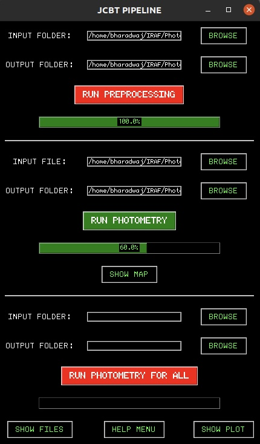
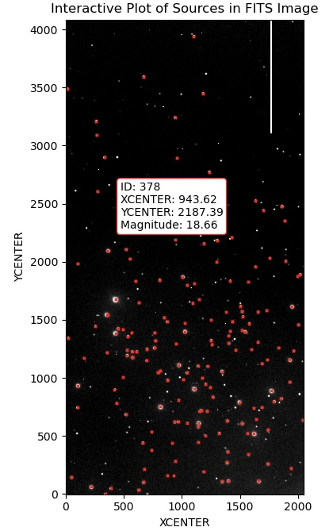
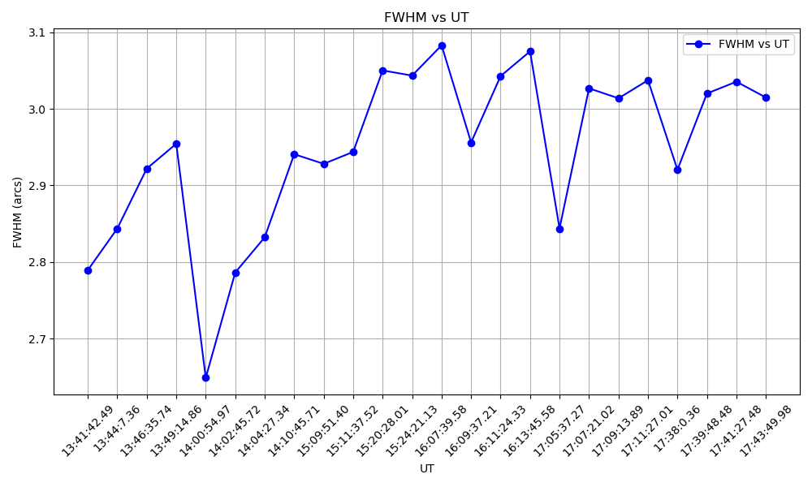

# User Interface

The user interface (UI) of the pipeline is structured into three main sections as shown below:

## 1. Preprocessing Section

This section allows users to specify the Input Folder containing raw FITS files and the Output Folder where the calibrated files will be stored.
The Run Preprocessing button executes the calibration process on the raw FITS files. The Progress Bar indicates the completion of the processing.

## 2. Photometry Section

Users can select the desired calibrated file from the input folder and specify an output folder to store the photometric data. 
The Run Photometry button executes the Aperture and PSF photometry process on the calibrated file.

## 3. Photometry for All Section

This section allows batch processing of multiple calibrated files. Users can specify an Input Folder containing all calibrated files and an Output Folder for the results.
The Run Photometry for All button executes the Aperture and PSF photometry process for all the calibrated files.  

## Additional Features

### Show Map  
Generates an interactive graphical representation of photometry for each frame, displaying sources with their coordinates and magnitude information as shown below,

### Show Plot  
Generates an FWHM vs. Unit Time plot for a particular observation night using all calibrated images as shown below,

### Help  
Provides details on the functionality of each UI element.

### Show Files  
Displays and grants access to the contents of the working folder.
