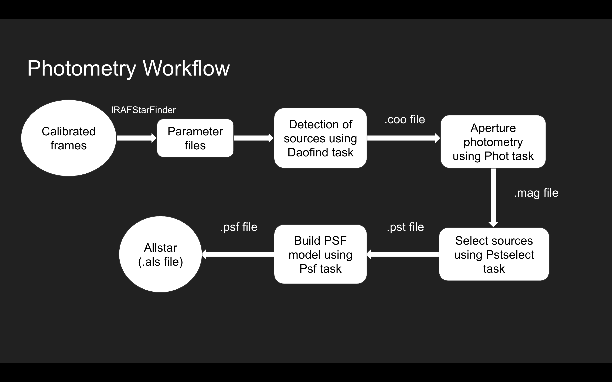

# Photometry Workflow

The reduction pipeline performs photometry on calibrated images to extract precise brightness measurements of astronomical sources. The overall workflow is as follows:

## 1) Calibrated Frame Selection

The pipeline scans the data directory and selects only calibrated FITS files with the _tbf.fits extension for photometric processing.

## 2) Parameter Identification

The DAOphot package in IRAF is used for photometric reduction. Before performing photometry, the pipeline estimates key parameters, including:        

### • FWHM of point sources        
### • Threshold for feature detection         
### • Background noise threshold         
### • Aperture radii sizes         
### • Minimum and maximum pixel count values         
### • Detector properties (e.g., read noise, gain)         

## 3) Source Detection

The pipeline uses the daofind function in IRAF to identify astronomical sources (e.g., stars) in each image. This function applies:
### • Thresholding algorithms to distinguish sources from background noise
### • Background subtraction techniques to isolate real celestial objects

The output includes key details such as object coordinates and brightness levels, facilitating further photometric analysis.

## 4) Aperture Photometry

Aperture photometry is performed using the phot task in IRAF, which measures the brightness of detected sources by summing pixel values within a specified aperture. The pipeline dynamically adjusts aperture size, shape, and background sky estimation values. A text file is generated containing instrumental magnitudes for each detected source, calculated for different aperture sizes.

## 5) Point Spread Function (PSF) Modeling

To refine photometry accuracy, the pipeline constructs a PSF model using the pstselect and psf tasks in IRAF. A set of isolated stars is selected to generate the PSF model. The model accounts for optical distortions and atmospheric effects, ensuring an accurate representation of star profiles. The output PSF model is later used by PSF-fitting photometry tasks like peak, nstar, and allstar.

## 6) PSF Photometry with Allstar

The pipeline utilizes the Allstar task in IRAF for PSF-fitting photometry, which improves the accuracy of magnitude measurements, especially in crowded fields. The PSF model from the psf task is applied to all detected stars in the image. The algorithm iteratively refines photometric measurements. A final output text file is generated, containing PSF-based magnitudes, which are more accurate than simple aperture photometry in dense fields.
